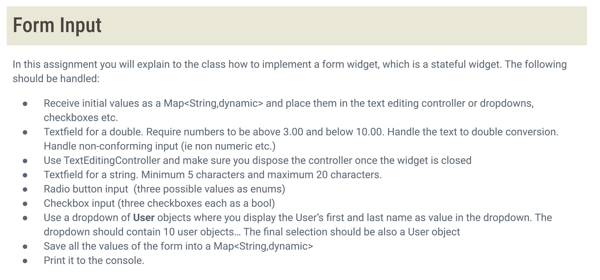

# flutter_application_1

A new Flutter project.

## Getting Started

This project is a starting point for a Flutter application.

A few resources to get you started if this is your first Flutter project:

- [Lab: Write your first Flutter app](https://docs.flutter.dev/get-started/codelab)
- [Cookbook: Useful Flutter samples](https://docs.flutter.dev/cookbook)

For help getting started with Flutter development, view the
[online documentation](https://docs.flutter.dev/), which offers tutorials,
samples, guidance on mobile development, and a full API reference.




## Dropdown

#### 1. When do we use a Dropdown?
Dropdown menus are commonly used when the user needs to select one option from a list of multiple items—especially when the list is too long for radio buttons. It helps save space and makes the UI more organized.

#### 2. Requirement:
1. Use a dropdown of User objects 
2. Display the User’s first and last name as the visible value
3. The dropdown should contain 10 User objects
4. The final selected value should also be a User object, not just a string

So our goal is to build a dropdown that works with custom User objects,


#### 3. My Implementation
First, I created the list of users using List.generate:
``` dart
final List<User> _users = List.generate(
    10,
    (index) => User('First$index', 'Last$index'),
);
 ```
This generates 10 User objects with names like First0 Last0, First1 Last1, and so on.
So, we have 10 users, each with a unique first and last name

<br><br>


Then I implemented the dropdown like this:
 ```dart
 User? _selectedUser;

...

// dropdown
DropdownButtonFormField<User>(
    value: _selectedUser,
    items: _users.map((user) {
        return DropdownMenuItem<User>(
        value: user,
        child: Text(user.toString()),
        );
    }).toList(),
    onChanged: (value) {
        setState(() {
        _selectedUser = value;
        });
    },
    decoration: const InputDecoration(labelTe/Users/Mitsuitou/Desktop/flutter_application_1/image.pngxt: 'User'),
    validator: (value) {
        if (value == null) {
            return 'Please select a user';
        }
        return null;
    },
),
```
Here’s how it works:
- value holds the currently selected User
- Each item is a DropdownMenuItem with a full User object as its value
- The label inside each dropdown item is the user’s full name, using user.toString()
- Validation ensures that a selection is made
- To make sure the dropdown can compare User objects correctly, I also overrode the == and hashCode methods in the User class.
``` dart
// user.dart
class User {
  final String firstName;
  final String lastName;

  User(this.firstName, this.lastName);

  @override
  String toString() => '$firstName $lastName';

  @override
  bool operator ==(Object other) =>
      identical(this, other) ||
      other is User &&
          firstName == other.firstName &&
          lastName == other.lastName;

  @override
  int get hashCode => firstName.hashCode ^ lastName.hashCode;
}
```

## SaveForm


``` dart
// save button
ElevatedButton(
    onPressed: _saveForm,
    child: const Text('Save'),
),
```

```dart
void _saveForm() {
if (_formKey.currentState!.validate()) {
    final formData = {
    'doubleValue': double.tryParse(_doubleController.text),
    'stringValue': _stringController.text,
    'radioValue': _selectedRadio,
    'checkbox1': _checkbox1,
    'checkbox2': _checkbox2,
    'checkbox3': _checkbox3,
    'dropdownValue': _selectedUser,
    };
    print(formData);
}
}
```
